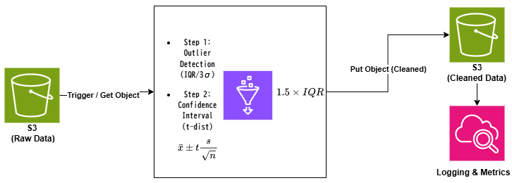
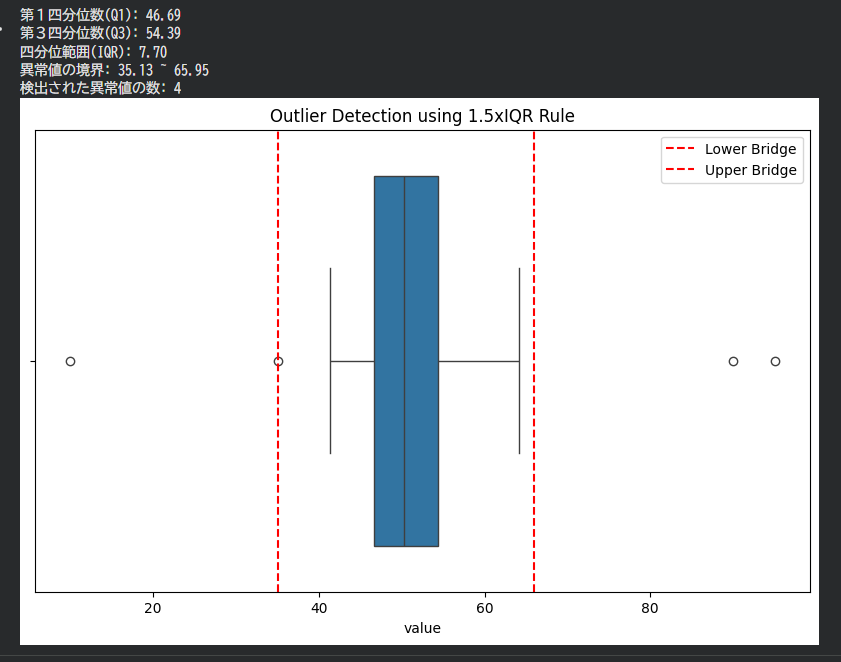

本セクションで実装された統計エンジンは、前段のS3データレイクから供給されるRawデータを受け取り、異常値を排除したクレンジング済みデータを後続のMLモデル学習プロセス（Sprint 3予定）へ提供する、パイプラインの「心臓部」として機能します。

# 📊 02_Statistics_L2: Statistics for Data Science

### 🏗️ Statistical Data Pipeline Architecture

> **Design Note**: 
> 本パイプラインは、AWS環境におけるデータ品質の自動担保を目的に設計されています。
> Rawデータに対して 
> 
> $$
  1.5 \times IQR
  $$ 
  
  法によるクレンジングを行い、
> その後 
> 
> $$
  t
  $$
  
分布を用いた推定を行うことで、信頼性の高いデータのみを後続プロセスへ提供します。

このセクションでは、統計検定2級およびデータサイエンス実務に必要な統計学的解析手法の学習と実装を記録します。

## 🎯 学習テーマ
- **データの記述**: 四分位数（Quartiles）や標準偏差を用いた分布の把握。
- **異常値検知**: 1.5xIQRルールおよび3σ法に基づく客観的な外れ値の特定。
- **データの標準化**: 異なる尺度（単位）を持つデータの無次元化と正規化。

---

## 🛠️ 実装プロジェクト1: 1.5xIQRによる外れ値検知

### 1. 概要
中央50%のデータ範囲（IQR）から算出される境界線に基づき、データのヒゲ（Whisker）を越える極端な値を「外れ値」として特定するロジックを実装しました。

---

## 🛠️ 実装プロジェクト2：標準化（Z-score）と3σ法

### 1. 概要
単位が異なるデータ（例：身長cmと体重kg）を同一指標で比較するための「標準化」を実装。あわせて正規分布の性質を利用した「3σ法」による異常検知プロセスを構築しました。

### 2. 数学的背景
#### 標準化（Z-score）
データを平均0、標準偏差1の標準正規分布に近似させます。

$$
z = \frac{x - \mu}{\sigma}
$$

#### 3σ（シグマ）法
平均から 

$$
\pm3\sigma
$$ 

以内に全データの **99.7%** が含まれる性質を利用し、

$$
|Z| > 3
$$ 

を異常と判定します。

### 3. 解析結果（エビデンス）

#### ■ 分布の変容プロセス
標準化により、異なるスケールの分布が共通のZ-score軸上に統合される様子を確認しました。

| Before Standardization | After Standardization |
| :---: | :---: |
|  |  |

#### ■ 統計的異常値の判定結果
標準化後のデータをプロット（KDE / Scatter）し、境界線

$$
Z = \pm 3
$$

との関係を可視化。統計的正常範囲を定義しました。

---

## 🛠️ 実装プロジェクト3：推測統計（信頼区間）

現在、標本データから母集団の平均を推定する「区間推定」を実装中。t分布を用いた95%信頼区間の算出により、データの真値を確率的に提示するロジックを構築しています。
---
## 🛠️ 実装プロジェクト4：AWS GlueによるサーバーレスETLパイプラインの構築

### 1. 概要
ローカルで実装した1.5xIQRロジックをクラウド環境（AWS）へ移植。S3をデータレイク、Glueをコンピューティングリソースとしたスケーラブルな分析基盤を構築しました。

### 2. クラウドネイティブな最適化 (FinOps)
実務での運用を想定し、以下のコスト最適化を施しています。
- **計算リソースの最小化**: AWS Glue Python Shell を採用。DPUを最小単位（0.0625）に設定し、実行コストを極小化。
- **ストレージの高速化**: 出力フォーマットに **Parquet（列指向形式）** を採用。後続のAthena等のクエリ実行時のスキャン容量削減と高速化を実現。

### 3. クラウド実装のエビデンス
クラウド上での正常動作を証明する実行ログおよび、CSVからParquetへ変換を構築しました。

| Glue Job Success | CloudWatch Logs (Outlier Detection) | AWS S3 (CSV → Parquet) |
| :---: | :---: | :---: |
|  |  |  |

> **Note**: 
> セキュリティ保護のため、AWSアカウントID等の機密情報はマスキング処理を施しています。